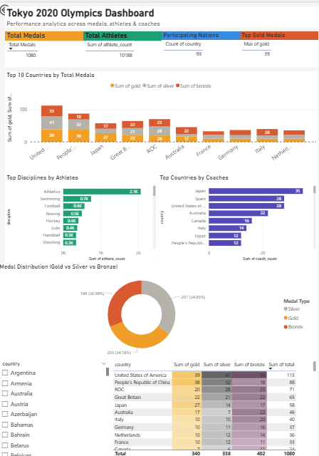

# 🏅 Tokyo Olympics Data Engineering Pipeline

## 📌 Project Overview
Built an end-to-end data engineering pipeline using Azure Databricks and ADLS, along with a Power BI dashboard for analytics.

---

## 📂 Data Source
Data is stored in **Azure Data Lake Storage (ADLS Gen2)**.

### Sample Olympic datasets used:
- Athletes  
- Coaches  
- Medals  
- Teams  
- EntriesGender  

---

## 🏗️ Architecture Diagram

---

## 🚀 Tech Stack
- PySpark  
- Azure Databricks  
- Azure Data Lake Storage (ADLS Gen2)  
- Power BI  

---

## ⚙️ Pipeline Steps
1. Data Ingestion from ADLS  
2. Data Cleaning & Transformation  
3. Data Modeling  
4. Output for Analytics  

---

## 📊 Datasets
- Athletes  
- Coaches  
- Medals  
- Teams  
- EntriesGender  

---

## 🔐 Note
All credentials are secured using placeholders / secrets.

---

## 🎯 Outcome
- Built scalable ETL pipeline  
- Implemented production-level transformations  
- Enabled analytics-ready data for Power BI  

---

## 📸 Dashboard Preview

---

## 📁 Project Structure
tokyo-olympics-data-engineering/
├── notebooks/ # Databricks notebooks
├── transformations/ # PySpark ETL scripts
├── dashboard/ # Power BI files & screenshots
├── images/ # Architecture diagrams
└── README.md
---

## 🚀 Features
- Built scalable ETL pipeline using PySpark  
- Processed multiple Olympic datasets  
- Created analytics-ready gold layer  
- Developed interactive Power BI dashboard  

---

## 👨‍💻 Author
**Srikanth B K**
